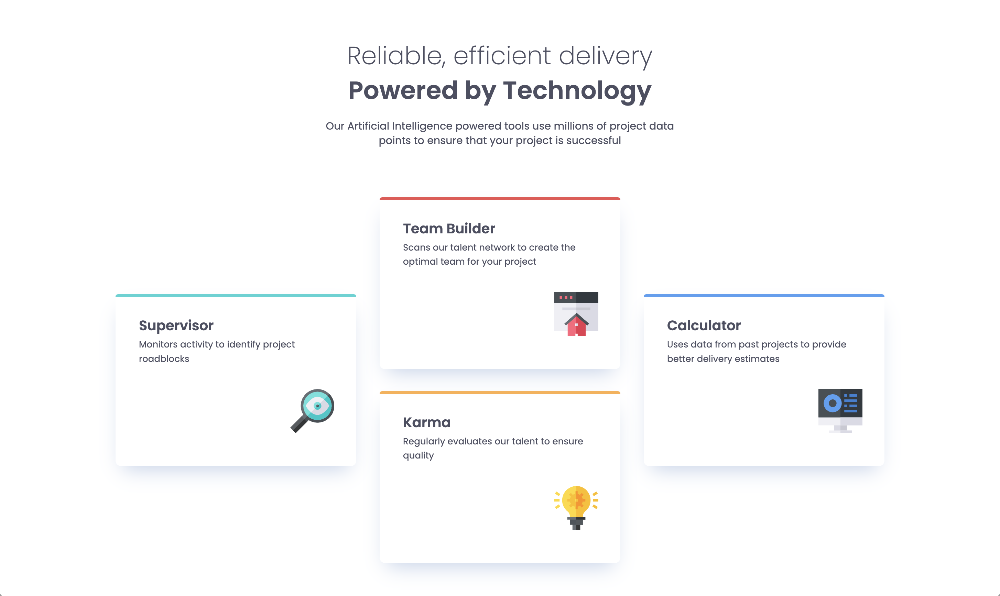

# Frontend Mentor - Four card feature section solution

This is a solution to the [Four card feature section challenge on Frontend Mentor](https://www.frontendmentor.io/challenges/four-card-feature-section-weK1eFYK). Frontend Mentor challenges help you improve your coding skills by building realistic projects.

## Table of contents

- [Overview](#overview)
  - [The challenge](#the-challenge)
  - [Screenshot](#screenshot)
  - [Links](#links)
- [My process](#my-process)
  - [Built with](#built-with)
  - [What I learned](#what-i-learned)
  - [Continued development](#continued-development)
  - [Useful resources](#useful-resources)
- [Author](#author)
- [Acknowledgments](#acknowledgments)

**Note: Delete this note and update the table of contents based on what sections you keep.**

## Overview

### The challenge

Users should be able to:

- View the optimal layout for the site depending on their device's screen size

### Screenshot

### Links

- Solution URL: [Add solution URL here](https://your-solution-url.com)
- Live Site URL: [Add live site URL here](https://your-live-site-url.com)

## My process

Because I'm doing these challenges as part of Frontend Mentor's Learning Path, I started this project by reading the articles and viewed the various resources for Cube CSS and explored the Utopia website to directly interact with their tools for setting up Fluid Typography and Fluid spacing. I found their idea to remove the need for `@media` queries very compelling. I didn't use their Fluid Typography tools on this project, I'll reserve that for future challenges.

My general process is to read the project requirements, download the challenge files and the figma files and set up my development environment from there. I used Sass on this project, so my first step was to set up an scss and css folder and use the terminal to link the folders, then set Sass to watch the two files.

Next I added my basic semantic markup, setting the headings body content with appropriate HTML tags. Then I began adding styles to the project based on the design files included in the project.

### Built with

- Semantic HTML5 markup
- CSS custom properties
- Flexbox
- CSS Grid
- Mobile-first workflow
- [Sass](https://sass-lang.com/) - For styles

### What I learned

This was good practice for working with Grid CSS, I also used custom data attributes for the card titles so I could identify them more readily in my stylesheets. I try to use BEM naming for my css class names, which are sometimes too generic when trying to keep track of the different content of the four cards. This made customizing the card layout a lot easier because I could use the more human readable `data-title` as my CSS selector. This was helpful when managing the different styles between the phone, tablet and desktop breakpoints.

### Continued development

I'm interested in the ideas around fluid typography and spacing as outlined in Andy Bell's talk. I'd like to explore that in greater depth with future challenge projects.

### Useful resources

- [Designer Tools - Chrome Extension](https://designer.tools/) - I started using this Chrome extension recently, it is so good for checking your work against the design files. Its worth checking out.

## Author

- Frontend Mentor - [@ldg](https://www.frontendmentor.io/profile/ldg)
